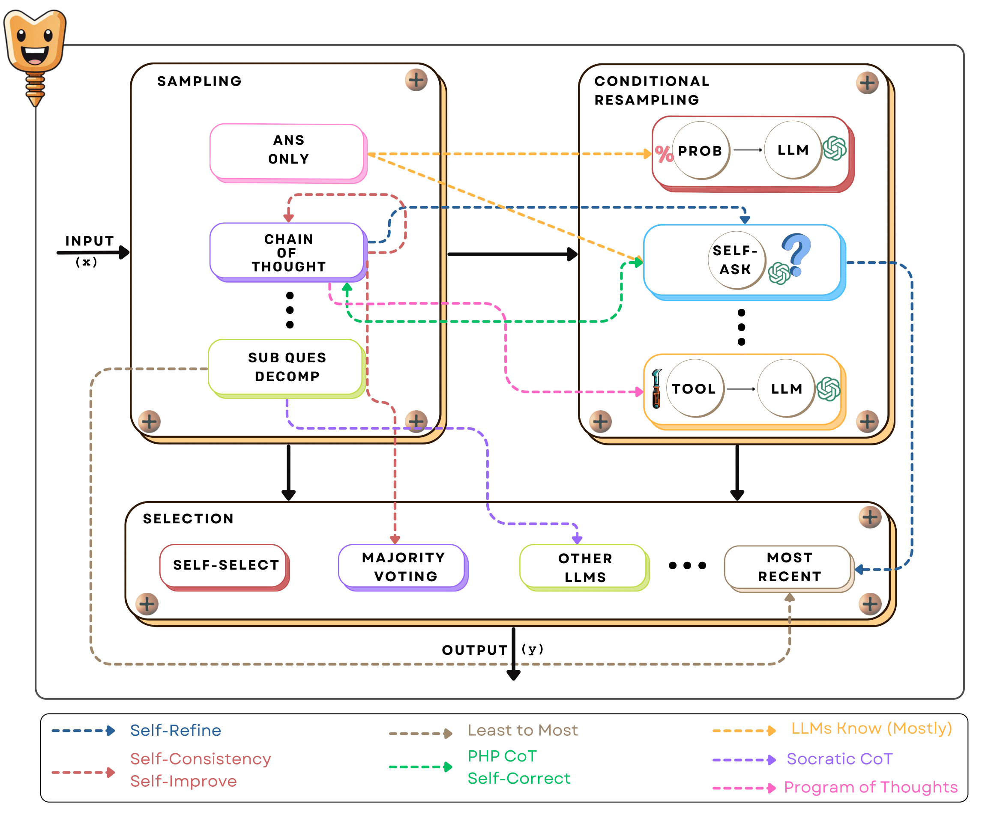

# SCREWS: A Modular Framework for Reasoning with Revisions

**SCREWS** is a modular reasoning-with-revisions framework to answer reasoning questions with LLMs. More details in the [paper]().




## How to run the code

* Clone the repo
```sh
git clone https://github.com/kumar-shridhar/Screws.git
```

* Install OpenAI, make an OpenAI account and keep the OpenAI key ready
```sh
pip install openai
```

### Sampling

* Start with the `sampling` module by running:

```sh
# CoT 
python sample.py --sampling_type cot --openai_key <OPENAI KEY> --data_path ./data/test_gsm8k.jsonl --result_path ./results/cot_sample.jsonl --prompt_path ./prompts/cot_sample.txt

#Subques
python sample.py --sampling_type subques --openai_key <OPENAI KEY> --data_path ./data/test_gsm8k_socratic.jsonl --result_path ./results/subques_sample.jsonl --prompt_path ./prompts/subques_sample.txt
```

### Conditional Resampling

* Once `sampling` is done, run the `resampling` code for generating the `CoT` and `Subques` version by:
```sh
# CoT 
python re-sample.py --sampling_type cot --openai_key <OPENAI KEY> --sample_path ./results/cot_sample.jsonl --result_path ./results/cot_resample.jsonl --resample_prompt_path ./prompts/cot_resample.txt

#Subques
python re-sample.py --sampling_type subques --openai_key <OPENAI KEY> --sample_path ./results/subques_sample.jsonl --result_path ./results/subques_resample.jsonl --sample_prompt_path ./prompts/subques_sample.txt --resample_prompt_path ./prompts/subques_resample.txt
```

### Selection

* Once `sampling` and `resampling` is done, run the `selection` code for choosing the desired output by:
```sh
# CoT 
python selection.py --sampling_type cot --openai_key <OPENAI KEY> --resample_path ./results/cot_resample.jsonl --result_path ./results/cot_selection.jsonl --prompt_path ./prompts/cot_selection.txt

#Subques
python selection.py --sampling_type subques --openai_key <OPENAI KEY> --resample_path ./results/subques_resample.jsonl --result_path ./results/subques_selection.jsonl --prompt_path ./prompts/subques_sample.txt --prompt_path ./prompts/cot_selection.txt
```

### Calculating Accuracy

```sh
python calculate_accuracy.py --result_file <PATH TO RESULT FILE> --sampling_type <cot or subques> --type <sample, resample or selection> 
```

## Citation

```sql
@misc{shridhar2023screws,
      title={SCREWS: A Modular Framework for Reasoning with Revisions}, 
      author={Kumar Shridhar and Harsh Jhamtani and Hao Fang and Benjamin Van Durme and Jason Eisner and Patrick Xia},
      year={2023},
      eprint={2309.13075},
      archivePrefix={arXiv},
      primaryClass={cs.AI}
}
```
